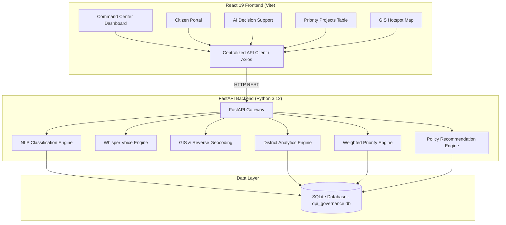
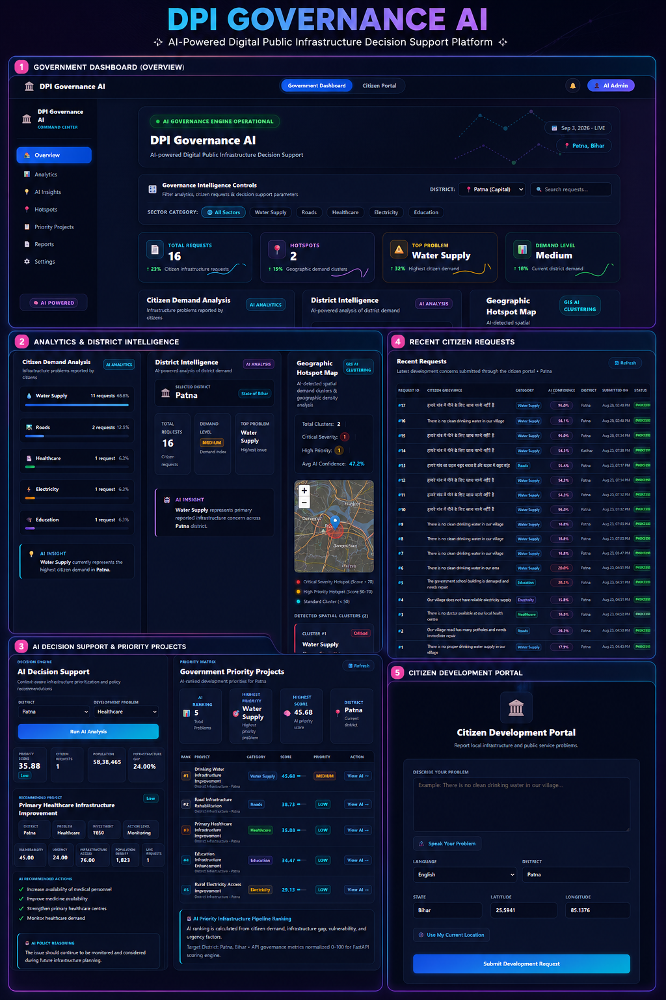

# DPI Governance AI

### AI-Powered Digital Public Infrastructure Decision Support Platform

---

DPI Governance AI is an enterprise-grade decision support platform that transforms unstructured citizen infrastructure grievances into structured, actionable governance intelligence. The system leverages AI/NLP request classification, district-level analytics, GIS hotspot cluster detection, multi-factor priority scoring, and contextual policy recommendations to help government decision-makers prioritize infrastructure investments efficiently.

---

## Recruiter Summary & Problem Statement

### The Engineering Challenge
In public infrastructure administration, citizen grievances arrive via diverse channels (text, voice, local dialects) and remain largely unstructured. Governance teams struggle to aggregate thousands of disparate reports into data-driven development priorities, leading to resource misallocation and delayed interventions.

### The Solution Pipeline
DPI Governance AI addresses this challenge through an end-to-end data processing pipeline:

```
Citizen Input (Voice / Text)
  └──> Multilingual NLP Classification
        └──> District Aggregation & Intelligence
              └──> GIS Spatial Hotspot Detection
                    └──> Multi-Factor Priority Engine
                          └──> AI Decision Support
                                └──> Government Priority Ranking
                                      └──> Actionable Policy Recommendations
```

---

## Key Features

1. **Citizen Request Submission**: Allows citizens to report localized infrastructure issues with real-time sector tagging and district mapping.
2. **Multilingual NLP Classification**: Automatically categorizes grievances (Water Supply, Roads, Healthcare, Education, Electricity) using Naive Bayes TF-IDF NLP classification.
3. **AI Voice Request Engine**: Converts spoken citizen voice input into structured text using an integrated local OpenAI Whisper model.
4. **Reverse Geocoding**: Automatically resolves latitude and longitude coordinates to district names and administrative boundaries.
5. **Government Command Center Dashboard**: Provides real-time governance metrics, top problems, demand levels, and live system status indicators.
6. **Sector Demand Analytics**: Visualizes percentage distribution and raw counts of citizen requests per infrastructure category.
7. **District Intelligence**: Offers automated situation overviews, district demand assessments, and high-level AI insights.
8. **Interactive GIS Hotspot Map**: Maps spatial cluster locations with custom severity indicators and geographic coordinates using Leaflet.
9. **Multi-Factor Priority Engine**: Calculates dynamic priority scores based on citizen demand, population impact, infrastructure gap, urgency, and vulnerability.
10. **Government Priority Projects**: Ranks development projects across sectors to surface high-priority interventions for administration teams.
11. **AI Decision Support**: Enables interactive policy scenario modeling by adjusting district parameters and running real-time AI impact calculations.
12. **Contextual Recommendations**: Provides estimated investment costs, required action items, and justification notes tailored to sector-specific gaps.
13. **Recent Citizen Requests**: Displays a live, searchable activity feed of citizen grievances with language indicators and AI confidence scores.

---

## How It Works

1. **Ingestion & Processing**: A citizen submits a grievance via voice or text through the Citizen Portal.
2. **NLP Classification**: The backend pipeline preprocesses the text and classifies it into an infrastructure category with an AI confidence rating.
3. **District Aggregation**: Requests are aggregated by district (e.g., Patna) to compute sector percentages, top issues, and overall demand levels.
4. **Spatial Analysis**: Geographic coordinates of reported grievances are analyzed to detect spatial demand clusters (hotspots).
5. **Multi-Factor Priority Calculation**: The backend priority engine evaluates five normalized governance inputs (0–100 scale):
   - **Citizen Demand** (weighted request volume)
   - **Population Impact** (log-normalized population index)
   - **Infrastructure Gap** (sector baseline deficit)
   - **Urgency Level** (time-sensitivity factor)
   - **Vulnerability Index** (socio-economic impact factor)
6. **Project Ranking**: Projects are dynamically sorted by their calculated priority score (`Critical` >= 70, `Medium` >= 45, `Low` < 45).
7. **Decision Support & Action**: Decision-makers select a project category or district to review recommended policy interventions, budget allocations, and execution steps.

---

## System Architecture



---

## Tech Stack

### Frontend
- **Framework**: React 19, Vite
- **Language**: JavaScript (ES6+)
- **Styling**: Vanilla CSS (Design Tokens, Dark Command Center Navy aesthetic)
- **Routing**: React Router 7
- **HTTP Client**: Axios (Centralized API base URL configuration)
- **Mapping & GIS**: Leaflet, React-Leaflet
- **Data Visualization**: Recharts

### Backend
- **Framework**: Python 3.12, FastAPI
- **Data Validation & ORM**: Pydantic v2, SQLAlchemy
- **Server**: Uvicorn
- **Database**: SQLite (`dpi_governance.db`)

### AI / ML / GIS
- **NLP / ML**: Scikit-Learn (Naive Bayes, TF-IDF Vectorizer), NLTK
- **Speech Recognition**: Local OpenAI Whisper
- **Audio Processing**: FFmpeg
- **Spatial / GIS Analytics**: GeoPandas, Shapely, PyProj

---

## Project Structure

```
dpi-governance-ai/
│
├── frontend/                     # React 19 Frontend Application
│   ├── src/
│   │   ├── components/          # DecisionSupport, PriorityProjects, HotspotMap
│   │   ├── pages/               # Dashboard, CitizenPortal
│   │   ├── services/            # Centralized api.js service
│   │   ├── App.jsx              # Main App layout & routing
│   │   └── index.css            # Dark Command Center design system
│   ├── .env.example             # Frontend environment template
│   └── package.json
│
├── backend/                      # FastAPI Backend Application
│   ├── app/
│   │   ├── api/                 # API Routes (analytics, requests, priority, etc.)
│   │   ├── db/                  # Database session & models
│   │   └── main.py              # FastAPI application entry point
│   └── requirements.txt         # Python dependencies
│
├── ml/                           # ML models & classification pipelines
├── data/                         # Sample datasets & seed scripts
├── docs/                         # Architecture documentation & guides
├── _archive/                     # Legacy backup files archive
├── .gitignore                    # Version control exclusion rules
└── README.md                     # Project documentation
```

---

## Getting Started

### Prerequisites
- Node.js (v18+) & npm
- Python 3.12+
- FFmpeg (required for voice transcription)

### 1. Environment Setup
Clone the repository and prepare environment files:
```bash
git clone https://github.com/your-username/dpi-governance-ai.git
cd dpi-governance-ai
```

Copy the frontend environment template:
```bash
cd frontend
cp .env.example .env
cd ..
```

### 2. Backend Setup
Create a Python virtual environment and install dependencies:
```bash
# From project root
python -m venv venv

# Activate virtual environment
# Windows PowerShell:
.\venv\Scripts\Activate.ps1
# macOS/Linux:
# source venv/bin/activate

# Install dependencies
pip install -r backend/requirements.txt
```

Start the FastAPI backend server:
```bash
python -m uvicorn backend.app.main:app --reload --host 127.0.0.1 --port 8000
```
*The API server will run at `http://127.0.0.1:8000`.*

### 3. Frontend Setup
In a new terminal window:
```bash
cd frontend
npm install
npm run dev
```
*The web dashboard will open at `http://localhost:5173`.*

---

## Environment Variables

### Frontend Configuration (`frontend/.env`)
```env
# Base URL pointing to the FastAPI backend
VITE_API_BASE_URL=http://127.0.0.1:8000
```

---

## API Overview

| Endpoint | Method | Description |
| :--- | :--- | :--- |
| `/requests/` | `GET` | Retrieve all citizen grievances or filter by district/category. |
| `/analytics/district/{district}` | `GET` | Get aggregated district intelligence, top issue, and demand percentages. |
| `/hotspots/district/{district}` | `GET` | Get geographic cluster data, coordinates, and severity indicators. |
| `/priority/calculate` | `POST` | Calculate priority score (0–100) and priority level from governance inputs. |
| `/recommendations/district/{district}/category/{category}` | `GET` | Fetch contextual policy recommendations, action points, and budget estimates. |
| `/voice/transcribe` | `POST` | Transcribe audio file to text using local Whisper engine. |
| `/location/reverse` | `POST` | Resolve coordinates (lat/lng) to district location metadata. |

---

## Engineering Highlights

- **Centralized API Architecture**: Utilizes an exported Axios client pattern with environment fallbacks (`import.meta.env.VITE_API_BASE_URL`) for clean deployment flexibility.
- **Asynchronous Data Orchestration**: Performs parallel data fetching across endpoints with structured fallback states during transient API disruptions.
- **Modular Component Design**: Decouples UI containers (Dashboard, Citizen Portal) from specialized functional modules (Decision Support, GIS Hotspot Map).
- **Dark Navy Command Center Design System**: Built with CSS variable design tokens, modern typography, glassmorphism card containers, and responsive flex/grid layouts.
- **Strict Data Sanitization & Normalization**: Normalizes large population figures into bounded logarithmic scales (0–100) to ensure mathematical stability in decision scoring.

---

## Verification & Production Audit

This codebase has undergone a formal production-readiness audit with verified benchmark results:

- **Frontend Production Build**: `npm run build` succeeds cleanly with 0 compilation warnings or errors.
- **Page Load Integrity**: All views (Dashboard, Citizen Portal, Hotspot Map, Priority Projects, Decision Support) load synchronously.
- **Interactive Verification**: All 5 sector category selectors and `View AI →` action paths execute seamlessly.
- **Layout & Responsiveness**: 0 page-level horizontal overflow on standard screen resolutions (tested at 1366px viewport width).
- **Console Hygiene**: 0 unhandled application exceptions or console errors.

---

## Current Local Demo Dataset State

*The metrics below represent the current active local demo dataset for Patna district:*

- **District**: Patna, Bihar
- **Total Requests**: 16
- **Geographic Hotspots**: 2 Clusters
- **Top Infrastructure Issue**: Water Supply
- **Demand Level**: Medium
- **Category Breakdown**:
  - Water Supply: 11 requests (68.75%)
  - Roads: 2 requests (12.50%)
  - Healthcare: 1 request (6.25%)
  - Education: 1 request (6.25%)
  - Electricity: 1 request (6.25%)

---

## Screenshots

### DPI Governance AI — Project Showcase

<p align="center">
  
</p>

> A consolidated view of the DPI Governance AI command center,
> decision-support engine, GIS hotspot analysis, priority projects,
> citizen requests, and citizen development portal.

---

## Future Improvements

- **Cloud Deployment**: Containerization via Docker and deployment to AWS / GCP.
- **Enterprise Database**: Migration from SQLite to PostgreSQL / PostGIS for multi-region spatial querying.
- **Authentication & RBAC**: Implementation of OAuth2 / JWT authentication for administrator and citizen roles.
- **Automated Report Export**: Generation of downloadable PDF/Excel governance audit summaries for department heads.
- **Model Monitoring & Retraining**: Automated pipeline for continuous NLP model evaluation as new grievances are resolved.

---

## Security & Repository Hygiene

- **Configuration Management**: Centralized API base URL via Vite environment variables; no hardcoded API endpoints in production components.
- **Git Hygiene**: Comprehensive `.gitignore` excludes virtual environments (`venv/`), database files (`*.db`), build artifacts (`dist/`), and OS metadata.
- **Secrets Management**: Secrets and private keys excluded from version control.

---

## License

*License status pending selection by author (e.g., MIT License or Apache 2.0).*

---

## Author

**[Your Name]**  
*AI & Software Engineer*  

*(Note: Replace `[Your Name]` with your full name and add your GitHub / LinkedIn profiles as appropriate.)*

